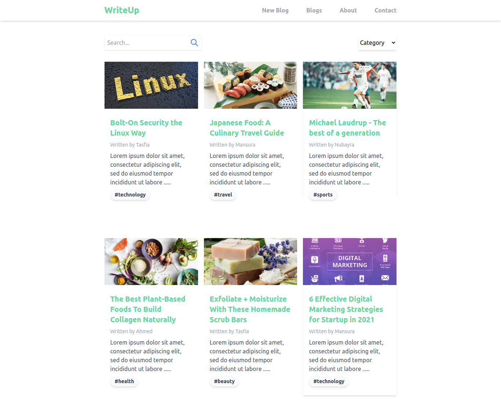

## WriteUp  
 A blog website used to add blogs to and show blogs from json server built with React, JavaScript, and Tailwind CSS.

### Project Demo
- Home

---
- Blog detail page

### Installation and Setup Instructions

Clone down this repository. You will need `node` and `npm` installed globally on your machine.  

Installation:

`npm install`  

To Run Test Suite:  

`npm test`  

Start json-server:

`npx json-server --watch data/db.json --port PORT_NUMBER` 

To Start Server:

`npm start`  

To Visit App:

`localhost:3000`  

